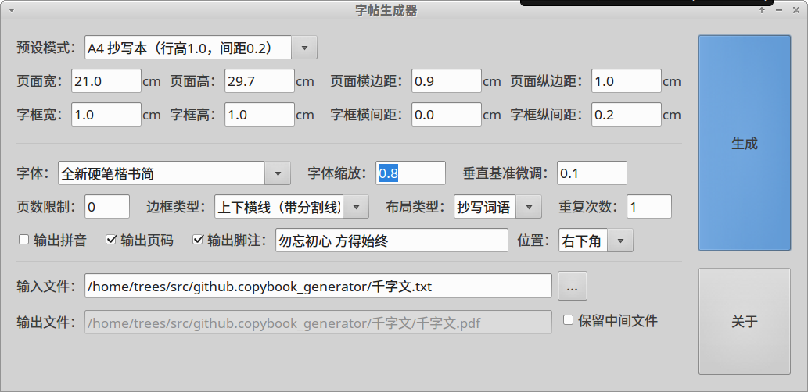
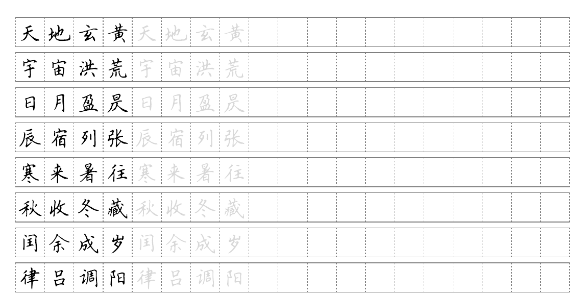
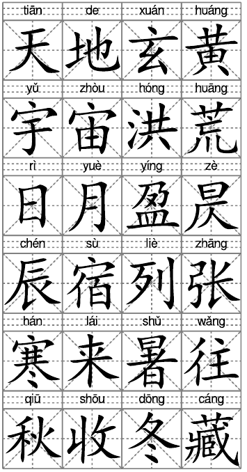

字帖生成器
==========

运行环境
--------

* linux
* svgwrite库生成svg模板
* cairosvg转换成单页pdf
* pdfrw合成整体pdf
* pypinyin库合成拼音
* wxPython生成界面

截图
----

主界面

* 

生成
* 
* 

URL: <https://github.com/pengshulin/copybook_generator>

Peng Shulin <trees_peng@163.com> 2017

